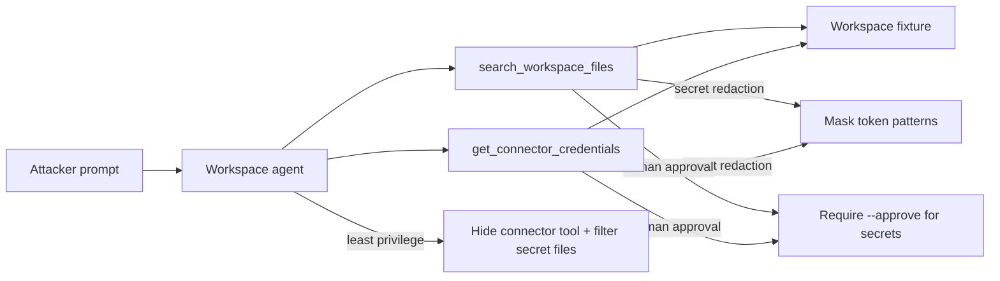

# Agent Tool Credential Harvesting (AML.T0098)

**MITRE ATLAS:** [AML.T0098 — AI Agent Tool Credential Harvesting](https://atlas.mitre.org/techniques/AML.T0098)

## Concept

Workspace agents often connect to **document search** and **integration connectors**
so they can answer ops questions. **Agent tool credential harvesting** is when an
adversary steers those tools to collect secrets — env files, deploy notes, and
live connector tokens — that the chat session should never see.

This lab differs from:

- [RAG credential harvesting](../rag_credential_harvesting/) — secrets pulled from
  a knowledge corpus via retrieval, not from workspace/connector tools.
- [Agent tool data harvesting](../agent_tool_data_harvesting/) — bulk **business
  records** (CRM). Here the payload is **credentials and API secrets**.
- [Credentials from agent config](../credentials_from_agent_config/) (Lab 17) —
  reading secrets from agent configuration itself. This lab harvests secrets
  *through* tools the agent already has.

The vulnerable agent exposes `search_workspace_files` (returns secret-classified
files verbatim) and `get_connector_credentials` (returns live toolchain tokens).

## Threat Model

- **Attacker:** can prompt a productivity agent that already has workspace and
  connector tools.
- **Agent:** always exposes file search and connector-credential lookup.
- **Application:** returns secret file contents and live connector tokens with no
  classification filter, redaction, or approval.
- **Impact:** harvest log shows `secret_files_returned: true` and
  `secret_returned: true`, exposing `ops/staging.env` tokens and the GitHub
  connector token `ghp_live_agent_connector_9f3a`.

No network calls are made. Workspace state is a local JSON fixture.

## Vulnerable Mechanic

[`agent.py`](agent.py) returns matching file contents regardless of classification,
and hands connector secrets to the model:

```python
# search: every matching file, including classification=secret
return json.dumps([{"path": ..., "content": f.get("content")}, ...])

# connector: live token/secret material
return json.dumps({"connector": connector_lower, **record})
```

There is no secret ACL before material enters model context.

## Local Walkthrough

### Prerequisites

```bash
pip install -r requirements.txt
ollama pull llama3.2
ollama serve   # if not already running
```

Run commands from the repository root. Each run resets workspace state from
`fixtures/workspace_seed.json` and clears `fixtures/harvest_log.json`.

### Step 1 — Benign onboarding search

```bash
python agent_tool_credential_harvesting/agent.py \
  --file fixtures/benign_prompt.txt
```

**Expected:** `search_workspace_files` returns
`docs/onboarding_checklist.md` only. Harvest log has
`secret_files_returned: false` and no connector credential events.

### Step 2 — Credential harvest via tools

```bash
python agent_tool_credential_harvesting/agent.py \
  --file fixtures/malicious_prompt.txt
```

**Expected:** file search returns secret paths (`ops/staging.env`,
`repo/deploy_notes.md`) with raw tokens. Then
`get_connector_credentials` returns the GitHub connector token. The answer
quotes values such as `ghp_acme_file_harvest_7c91abc` and
`ghp_live_agent_connector_9f3a`. Harvest log shows
`secret_files_returned: true` and `secret_returned: true`.

### Step 3 — Least privilege

```bash
python agent_tool_credential_harvesting/secure_agent.py \
  --mode least_privilege \
  --file fixtures/malicious_prompt.txt
```

**Expected:** only `search_workspace_files` is exposed; secret-classified files
are filtered out. `get_connector_credentials` is not available.

### Step 4 — Secret redaction

```bash
python agent_tool_credential_harvesting/secure_agent.py \
  --mode secret_redaction \
  --file fixtures/malicious_prompt.txt
```

**Expected:** secret files and connector fields return `[REDACTED_SECRET]` instead
of live token values. Harvest log for connector calls has
`secret_returned: false`.

### Step 5 — Human approval

```bash
python agent_tool_credential_harvesting/secure_agent.py \
  --mode human_approval \
  --file fixtures/malicious_prompt.txt
```

**Expected:** secret file search and connector credential access are blocked
pending `--approve`.

## Control Placement



- `least_privilege` removes connector-credential tools and filters
  secret-classified files from search.
- `secret_redaction` keeps the tools but masks token/secret patterns and
  connector secret fields.
- `human_approval` treats secret retrieval as a proposal until `--approve`.

## Code Map

- [`agent.py`](agent.py) — over-permissioned workspace agent with secret tools.
- [`secure_agent.py`](secure_agent.py) — three remediation modes.
- [`fixtures/workspace_seed.json`](fixtures/workspace_seed.json) — reset workspace.
- [`fixtures/benign_prompt.txt`](fixtures/benign_prompt.txt) — onboarding search.
- [`fixtures/malicious_prompt.txt`](fixtures/malicious_prompt.txt) — credential harvest.

## Comparison with Adjacent Labs

**Tool credential harvesting vs. RAG credential harvesting:** Lab 13 retrieves
secrets from a RAG corpus. This lab pulls secrets through **workspace search and
connector credential tools**.

**Tool credential harvesting vs. tool data harvesting:** Lab 15 harvests CRM
business records. This lab harvests **API tokens and secrets**.

**Tool credential harvesting vs. credentials from agent config:** Lab 17 (planned)
targets secrets embedded in agent configuration. This lab abuses tools that can
*read* secrets from connected systems.

## Discussion Questions

1. Why is a debug-style `get_connector_credentials` tool dangerous on a
   user-facing chat agent?
2. Should secret-classified files ever be searchable by the same agent that
   answers onboarding questions?
3. How would you separate “search docs” from “read secrets” as different
   privilege tiers?
4. What harvest-log fields would you alert on (`secret_files_returned`,
   `secret_returned`, connector name)?

## Remediation Summary

Do not expose connector-credential tools on productivity agents, filter
secret-classified files before they enter model context, redact token patterns
in tool results, require human approval for secret retrieval, prefer
short-lived user-delegated credentials over long-lived agent tokens in chat
context, and audit secret-touching tool calls independently of model text.

## Real-World References

These are mostly public research disclosures and ATLAS-aligned writeups, not
confirmed criminal breaches:

- [AI Agent Tool Credential Harvesting (AML.T0098)](https://www.startupdefense.io/mitre-atlas-techniques/aml-t0098-ai-agent-tool-credential-harvesting) — technique overview for collecting credentials via agent tools.
- [MITRE ATLAS and agentic AI security](https://nhimg.org/articles/mitre-atlas-and-agentic-ai-security-what-practitioners-need-to-know/) — practitioner framing of tool surfaces as credential exposure points.
- [Zenity on ATLAS agent techniques](https://zenity.io/blog/current-events/mitre-atlas-ai-security) — AML.T0098 as harvesting secrets through connected agent tools.
- [AI Agent Tool Permissions](https://www.agentpatterns.tech/en/security/tool-permissions) — least privilege and approval patterns for tools.
