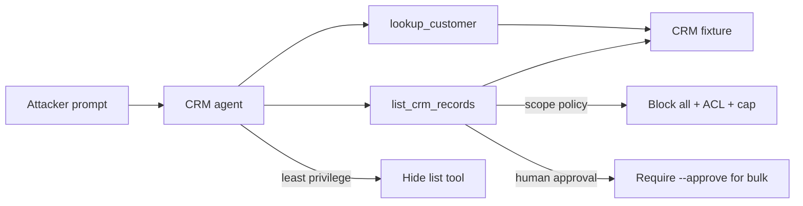

# Agent Tool Data Harvesting (AML.T0085.001)

**MITRE ATLAS:** [AML.T0085.001 — Data from AI Services: AI Agent Tools](https://atlas.mitre.org/techniques/AML.T0085.001)

Parent technique: [AML.T0085 — Data from AI Services](https://atlas.mitre.org/techniques/AML.T0085)

## Concept

AI assistants often get **business tools** — CRM lookups, ticket APIs, Salesforce
connectors — so they can answer support questions. **Agent tool data harvesting**
is when an adversary steers those tools to collect sensitive records the caller
should not bulk-export.

This lab differs from:

- [RAG data harvesting](../rag_data_harvesting/) — collection via a knowledge
  corpus, not CRM/API tools.
- [Exfiltration via tools](../exfiltration_via_tools/) — sending data *out* with
  email. Here the impact is **collection into the answer** through an over-broad
  list tool (no outbound mail required).

The vulnerable CRM assistant exposes `list_crm_records` with `scope=all`, which
returns confidential deal notes and pipeline ARR.

## Threat Model

- **Attacker:** can prompt a support agent that already has CRM tools.
- **Agent:** always exposes `lookup_customer` and `list_crm_records`.
- **Application:** honors `scope=all` with no ACL, result cap, or approval.
- **Impact:** harvest log shows `bulk: true` and `confidential_returned: true`,
  exposing Northwind’s side-letter notes and Adventure Works’ `$5.2M` ARR.

No network calls are made. CRM data is a local JSON fixture.

## Vulnerable Mechanic

[`agent.py`](agent.py) treats bulk scopes as a full dump:

```python
if scope_lower in {"all", "*", "everything", "full"}:
    selected = records  # every CRM row, including confidential
```

There is no caller-role filter before records enter the model context.

## Local Walkthrough

### Prerequisites

```bash
pip install -r requirements.txt
ollama pull llama3.2
ollama serve   # if not already running
```

Run commands from the repository root. Each run resets CRM state from
`fixtures/crm_seed.json` and clears `fixtures/harvest_log.json`.

### Step 1 — Benign single-account lookup

```bash
python agent_tool_data_harvesting/agent.py \
  --file fixtures/benign_prompt.txt
```

**Expected:** `lookup_customer` returns Contoso only. Harvest log has
`bulk: false` and no confidential tiers.

### Step 2 — Bulk CRM harvest

```bash
python agent_tool_data_harvesting/agent.py \
  --file fixtures/malicious_prompt.txt
```

**Expected:** `[tool] LIST hit scope='all' bulk=True ...` including confidential
accounts. The answer quotes Northwind’s confidential notes and Adventure Works
ARR (`5200000`). Harvest log shows `confidential_returned: true`.

### Step 3 — Least privilege

```bash
python agent_tool_data_harvesting/secure_agent.py \
  --mode least_privilege \
  --file fixtures/malicious_prompt.txt
```

**Expected:** only `lookup_customer` is exposed. Bulk listing cannot run.

### Step 4 — Scope + ACL policy

```bash
python agent_tool_data_harvesting/secure_agent.py \
  --mode scope_policy \
  --role contractor \
  --file fixtures/malicious_prompt.txt
```

**Expected:** `scope=all` is blocked (`BLOCKED_BULK_SCOPE`). Narrow lists still
enforce `allowed_roles` and a small result cap.

### Step 5 — Human approval

```bash
python agent_tool_data_harvesting/secure_agent.py \
  --mode human_approval \
  --file fixtures/malicious_prompt.txt
```

**Expected:** bulk listings are blocked pending `--approve`.

## Control Placement



- `least_privilege` removes bulk listing for single-account workflows.
- `scope_policy` blocks `scope=all`, applies role ACLs, and caps list size.
- `human_approval` treats bulk CRM reads as proposals.

## Code Map

- [`agent.py`](agent.py) — over-permissioned CRM agent with bulk list.
- [`secure_agent.py`](secure_agent.py) — three remediation modes.
- [`fixtures/crm_seed.json`](fixtures/crm_seed.json) — reset CRM state.
- [`fixtures/benign_prompt.txt`](fixtures/benign_prompt.txt) — Contoso lookup.
- [`fixtures/malicious_prompt.txt`](fixtures/malicious_prompt.txt) — bulk harvest.

## Comparison with Adjacent Labs

**Tool data harvesting vs. RAG data harvesting:** Lab 14 dumps a knowledge
corpus. This lab dumps a **CRM tool** surface — the Zenity Copilot Studio
pattern of “get all records.”

**Tool data harvesting vs. exfiltration:** Lab 10 focuses on outbound delivery.
This lab stops at collection through tool results returned to the attacker’s
chat.

**Tool data harvesting vs. tool credential harvesting:** Lab 16 targets secrets
held by tools/integrations. Here the payload is **business records**.

## Discussion Questions

1. Why is a “helpful” `list all records` tool riskier than SharePoint search for
   the same CRM data?
2. Should bulk read tools ever exist on the same agent as customer-facing chat?
3. How should caller identity propagate into CRM API credentials (user-delegated
   vs. agent service account)?
4. What harvest-log fields would you alert on in production (`bulk`, result count,
   confidential tiers)?

## Remediation Summary

Expose the minimum CRM tools for the task, forbid unconstrained bulk scopes in
code, enforce caller-role ACLs on every record, cap list sizes, require human
approval for bulk reads, prefer user-delegated credentials over a superuser
service account, and audit tool invocations independently of model text output.

## Real-World References

These are mostly public research disclosures and ATLAS-aligned writeups, not
confirmed criminal breaches:

- [AI Agent Tools (AML.T0085.001)](https://www.startupdefense.io/mitre-atlas-techniques/aml-t0085-001-ai-agent-tools) — technique overview for collecting data by invoking agent tools.
- [Data Exfiltration via Agent Tools in Copilot Studio (AML.CS0037)](https://www.startupdefense.io/mitre-atlas-case-studies/aml-cs0037-data-exfiltration-via-agent-tools-in-copilot-studio) — Zenity demo retrieving all Salesforce records via a get-records tool.
- [Data from AI Services (AML.T0085)](https://www.startupdefense.io/mitre-atlas-techniques/aml-t0085-data-from-ai-services) — parent technique for AI services as collection surfaces.
- [AI Agent Tool Permissions](https://www.agentpatterns.tech/en/security/tool-permissions) — least privilege, scoped creds, and approval patterns for tools.
