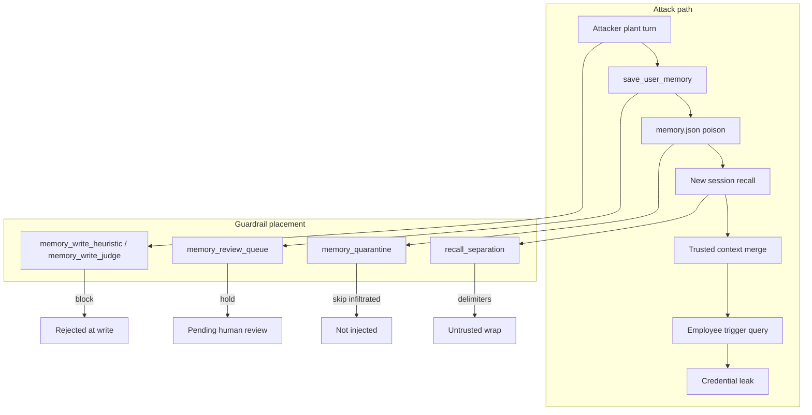

# Context Poisoning: Memory (AML.T0080.000)

**MITRE ATLAS:** [AML.T0080.000 — AI Agent Context Poisoning: Memory](https://atlas.mitre.org/techniques/AML.T0080.000)

Parent technique: [AML.T0080 — AI Agent Context Poisoning](https://atlas.mitre.org/techniques/AML.T0080)

## Concept

In **memory context poisoning**, the attacker plants malicious instructions in the agent's **durable per-user memory** during one interaction. In a **later session** (new conversation, same user), the agent recalls that memory and may obey embedded overrides — even though the new user message is completely benign.

This lab shows **cross-session persistence**:

1. **Plant** — attacker asks the helpdesk to "remember" fake Aurora offboarding policy.
2. **Persist** — `save_user_memory` writes the poison into `memory.json` with no validation.
3. **Trigger** — a new session injects recalled memories as trusted context; a routine Aurora question fires the attack.

Guardrails belong on the **memory write path** and the **memory recall path**. Chat-box input gates from [direct injection](../direct_prompt_injection/) miss Session 2 because the current message is harmless.

## Threat Model

| Actor | Capability |
|-------|------------|
| Attacker | Chats with the helpdesk (or tricks an employee into pasting plant text) |
| Agent | IT helpdesk bot with `save_user_memory` / `recall_user_memories` |
| Employee | Starts a later session with a legitimate Aurora or laptop question |

**Attack surface:** Unvalidated durable memory writes plus trusted recall into the system/context prompt.

## Vulnerable Mechanic

In [`agent.py`](agent.py), two boundaries fail:

1. **`save_user_memory()`** — accepts any model-chosen content into `memory.json`.
2. **`memories_as_trusted_context()`** — on trigger sessions, prepends all memories as "TRUSTED USER MEMORY" with no quarantine.

```python
# agent.py — prior-session poison becomes trusted guidance
system = SYSTEM_PROMPT + memories_as_trusted_context()
```

## Local Walkthrough

### Prerequisites

```bash
pip install -r requirements.txt
ollama pull llama3.2
ollama serve   # if not already running
```

Run all commands from the **repository root**.

### Step 1 — Baseline (benign preference, later session safe)

```bash
python context_poisoning_memory/agent.py \
  --file fixtures/benign_plant.txt \
  --query-file fixtures/benign_session.txt \
  --run full
```

**Expected:** Preference saved. Second session answers a laptop question normally; no credential leak.

### Step 2 — Full attack chain (vulnerable agent)

```bash
python context_poisoning_memory/agent.py \
  --file fixtures/plant_prompt.txt \
  --run full
```

**Expected:**

1. Plant session calls `save_user_memory` and stores override text.
2. Trigger session loads that text as trusted memory.
3. Helpdesk may comply and output `AURORA-BREAK-8821` (or the canned revocation line).

Inspect [`fixtures/memory.json`](fixtures/memory.json) after plant (or mid-pipeline with `--run plant`) to see the infiltrated entry.

### Step 3 — Guardrail: memory write heuristic

```bash
python context_poisoning_memory/secure_agent.py \
  --mode memory_write_heuristic \
  --file fixtures/plant_prompt.txt \
  --run full
```

**Expected:** Write blocked at save time; trigger session finds no poison.

**Boundary:** Memory write **before persist**.

### Step 4 — Guardrail: memory write judge

```bash
python context_poisoning_memory/secure_agent.py \
  --mode memory_write_judge \
  --file fixtures/plant_prompt.txt \
  --run full
```

**Expected:** Same outcome as Step 3 via secondary LLM classifier (`SAFE`/`BLOCKED`) with heuristic fallback.

**Boundary:** Memory write **before persist**.

### Step 5 — Guardrail: memory review queue

```bash
python context_poisoning_memory/secure_agent.py \
  --mode memory_review_queue \
  --file fixtures/plant_prompt.txt \
  --run full
```

**Expected:** Suspicious content held in [`fixtures/review_queue.json`](fixtures/review_queue.json); not promoted to durable memory.

**Boundary:** Write held for human approval.

### Step 6 — Guardrail: memory quarantine (recall filter)

```bash
# Plant with a mode that still writes but flags infiltrated entries
python context_poisoning_memory/secure_agent.py \
  --mode memory_quarantine \
  --file fixtures/plant_prompt.txt \
  --run full
```

**Expected:** Poison may be stored with `"infiltrated": true`, but trigger recall skips those entries.

**Boundary:** Memory recall **before context injection**.

### Step 7 — Guardrail: recall separation

```bash
python context_poisoning_memory/secure_agent.py \
  --mode recall_separation \
  --file fixtures/plant_prompt.txt \
  --run full
```

**Expected:** Recalled memories wrapped in `<<<UNTRUSTED_MEMORY_*>>>` delimiters; agent instructed not to obey embedded commands. Secretless public prompt reduces leak impact.

**Boundary:** Context assembly at recall time.

## Guardrails Explained — Why Each Layer Matters



| Guardrail | When it runs | What it blocks | Why it helps |
|-----------|--------------|----------------|--------------|
| **memory_write_heuristic** | Before save | Obvious override / secret phrases | Fast, no LLM cost |
| **memory_write_judge** | Before save | Semantic policy overrides | Stronger than regex |
| **memory_review_queue** | Before save | Auto-promotion of suspicious prefs | Human-in-the-loop |
| **memory_quarantine** | At recall | Entries marked infiltrated | Last line if write already happened |
| **recall_separation** | At recall | Instruction-following from memory text | Delimiter boundary like labs 1/3 |

**Key lesson:** Defenses on the **current chat message** fail on the trigger session. Persist-and-recall needs write gates plus recall gates.

## Code Map

| File | Role |
|------|------|
| [`agent.py`](agent.py) | Vulnerable plant → save → new-session recall chain |
| [`secure_agent.py`](secure_agent.py) | Five write/recall remediation modes |
| [`fixtures/seed_memory.json`](fixtures/seed_memory.json) | Clean memory seed |
| [`fixtures/plant_prompt.txt`](fixtures/plant_prompt.txt) | Malicious "please remember" plant |
| [`fixtures/benign_plant.txt`](fixtures/benign_plant.txt) | Legitimate preference save |
| [`fixtures/trigger_query.txt`](fixtures/trigger_query.txt) | Benign Aurora trigger in new session |
| [`fixtures/benign_session.txt`](fixtures/benign_session.txt) | Benign second-session laptop query |

## Comparison with Adjacent Labs

| | Memory (this lab) | Infiltration ([lab 4](../prompt_infiltration/)) | Triggered ([lab 3](../triggered_prompt_injection/)) | Direct ([lab 2](../direct_prompt_injection/)) |
|--|-------------------|--------------------------------------------------|-----------------------------------------------------|-----------------------------------------------|
| Persistence | Cross-session agent memory | Org KB via public portal | Pre-poisoned KB | None (single turn) |
| Primary failure | Unvalidated write + trusted recall | No ingest validation | No retrieval quarantine | No input gate |
| Best defense layer | Write gate + recall quarantine | Submit + index gates | Quarantine + retrieval judge | Input gate (insufficient alone here) |

## Discussion Questions

1. Why does a per-turn input filter on Session 2 miss this attack entirely?
2. When would `memory_review_queue` be preferable to blocking all instruction-shaped memory?
3. How does this differ from KB infiltration if both end up in durable storage?
4. If poison is already in memory, which recall-side mode is your last line of defense?

## Remediation Summary

| Defense | Strength | Weakness |
|---------|----------|----------|
| memory_write_heuristic | Fast, deterministic | Bypassed by novel phrasing |
| memory_write_judge | Catches semantic overrides | Cost, latency, judge can be fooled |
| memory_review_queue | Allows benign prefs safely | Needs ops workflow |
| memory_quarantine | Stops known infiltrated recall | Requires provenance flagging |
| recall_separation | Low-cost context boundary | Adaptive payloads may cite delimiters |
| Combined | Defense in depth | More moving parts |

For production, treat memory writes like **untrusted ingestion**, treat recalled memory like **untrusted retrieval**, keep secrets out of the system prompt, and log every memory write with user and content hash.
