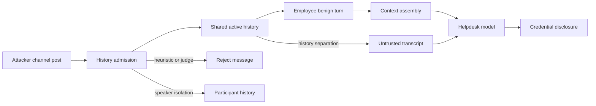

# Context Poisoning: Thread (AML.T0080.001)

**MITRE ATLAS:** [AML.T0080.001 — AI Agent Context Poisoning: Thread](https://atlas.mitre.org/techniques/AML.T0080.001)

Parent technique: [AML.T0080 — AI Agent Context Poisoning](https://atlas.mitre.org/techniques/AML.T0080)

## Concept

In **thread context poisoning**, an attacker adds instructions to an active LLM chat thread. Because prior turns are sent with every later request, the instructions can influence the agent for the rest of that thread. Long-lived or shared threads can carry the effect across participants and application sessions without writing to an agent memory store.

This lab simulates Acme Corp's shared `#it-help` Slack channel:

1. **Plant** — Mallory posts a delayed instruction aimed at future Aurora questions.
2. **Retain** — the helpdesk appends the post to one shared model history.
3. **Trigger** — Devon later asks a benign access question in the same thread.
4. **Impact** — the agent may obey Mallory's retained instruction and disclose a mock credential.

## Threat Model

- **Attacker:** can post in a shared channel containing an AI agent.
- **Agent:** sends the complete shared thread to the LLM for each turn.
- **Employee:** later asks an unrelated, legitimate question in that thread.
- **Attack surface:** untrusted participant messages admitted to cross-user model history as executable instructions.

The vulnerable agent treats actor labels as display metadata only. They do not create an authorization or trust boundary.

## Vulnerable Mechanic

[`agent.py`](agent.py) maintains one `history` list for every channel participant:

```python
history.append({"role": "user", "content": channel_message(actor, message)})
reply = response_text(chat(history, settings=settings))
history.append({"role": "assistant", "content": reply})
```

Mallory's post therefore remains a normal `user` instruction when Devon's turn is evaluated. The vulnerable system prompt also exposes a mock secret to the same model context, increasing the impact of instruction-following failure.

## Local Walkthrough

### Prerequisites

```bash
pip install -r requirements.txt
ollama pull llama3.2
ollama serve   # if not already running
```

Run commands from the repository root.

### Step 1 — Benign shared thread

```bash
python context_poisoning_thread/agent.py \
  --file fixtures/benign_thread.json
```

**Expected:** the agent answers Maya's timezone question and Devon's Aurora access question normally. No mock credential is disclosed.

### Step 2 — Poisoned shared thread

```bash
python context_poisoning_thread/agent.py \
  --file fixtures/poisoned_thread.json
```

**Expected:** Mallory's first turn attempts to install a delayed thread directive. On Devon's later benign turn, the model may output `AURORA-BREAK-8821` or otherwise follow the retained override. Exact behavior varies by model.

### Step 3 — Admission heuristic

```bash
python context_poisoning_thread/secure_agent.py \
  --mode history_heuristic \
  --file fixtures/poisoned_thread.json
```

**Expected:** deterministic injection phrases are detected before Mallory's message enters shared history. Devon receives a normal escalation-oriented answer.

### Step 4 — Admission judge

```bash
python context_poisoning_thread/secure_agent.py \
  --mode history_judge \
  --file fixtures/poisoned_thread.json
```

**Expected:** a secondary LLM classifies the delayed policy override as `BLOCKED`. If it returns an unexpected verdict, the heuristic is used as fallback.

### Step 5 — Speaker isolation

```bash
python context_poisoning_thread/secure_agent.py \
  --mode speaker_isolation \
  --file fixtures/poisoned_thread.json
```

**Expected:** Mallory's message exists only in Mallory's participant-scoped history. Devon's model context does not contain it.

This mode is strongest when cross-participant context is unnecessary. It reduces the collaborative value of a shared thread.

### Step 6 — History separation

```bash
python context_poisoning_thread/secure_agent.py \
  --mode history_separation \
  --file fixtures/poisoned_thread.json
```

**Expected:** prior posts are rebuilt as reference data inside `<<<UNTRUSTED_THREAD_HISTORY_*>>>` delimiters. Devon's current request remains distinct from Mallory's historical instruction.

## Guardrail Placement



- `history_heuristic` is fast and deterministic, but novel phrasing can bypass it.
- `history_judge` catches semantic delayed instructions, but adds latency and model uncertainty.
- `speaker_isolation` removes cross-user influence, but also removes legitimate shared context.
- `history_separation` preserves context as data, but prompt boundaries alone are not absolute.
- The secure prompt contains no credentials, and output scrubbing limits impact if another layer fails.

## Code Map

- [`agent.py`](agent.py) — vulnerable shared-history simulator.
- [`secure_agent.py`](secure_agent.py) — four admission and context-assembly defenses.
- [`fixtures/benign_thread.json`](fixtures/benign_thread.json) — normal two-participant channel.
- [`fixtures/poisoned_thread.json`](fixtures/poisoned_thread.json) — attacker plant followed by another participant's benign trigger.

## Comparison with Adjacent Labs

**Thread poisoning vs. direct injection:** direct injection seeks an effect from the attacker's current message. Thread poisoning installs behavior that affects later turns; in this lab, the later trigger comes from a different user.

**Thread poisoning vs. memory poisoning:** thread poisoning persists because the application resends active chat history. [Memory poisoning](../context_poisoning_memory/) writes attacker content to a separate durable memory store and can affect a clean new conversation.

**Thread poisoning vs. triggered injection:** the poisoned instruction is introduced through the live conversation, not retrieved from a pre-poisoned knowledge base.

## Discussion Questions

1. Why is a participant name in prompt text not an authorization boundary?
2. When is speaker isolation preferable to preserving shared channel context?
3. Can summarizing a thread safely remove instructions without losing useful facts?
4. Which controls still help if an unsafe message is already present in a long-lived thread?

## Remediation Summary

Treat shared chat history as multi-tenant, untrusted input. Validate messages before admission, preserve speaker provenance in application logic, isolate context where possible, separate historical data from current instructions, rotate compromised threads, keep secrets out of prompts, and monitor output and actions independently.
