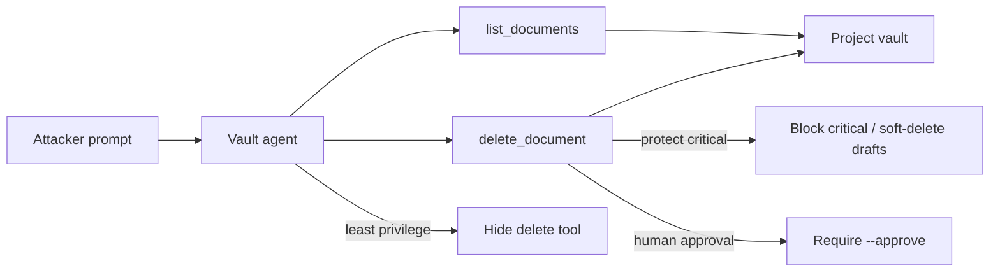

# Data Destruction via Tools (AML.T0101)

**MITRE ATLAS:** [AML.T0101 — Data Destruction via AI Agent Tool Invocation](https://atlas.mitre.org/techniques/AML.T0101)

## Concept

Once an AI agent can call tools that mutate storage, an adversary can steer those
tools toward **availability impact**: permanent deletes, mass wipes, or
corruption of files that the business depends on.

This lab specializes [AML.T0053](../unbounded_tool_misuse/) (general tool
invocation) into a destructive outcome. A project-vault assistant that should
answer “what’s in this folder?” also receives a hard-delete tool, and the
application executes whatever document id the model supplies.

## Threat Model

- **Attacker:** can send prompts to an agent that already has a delete tool.
- **Agent:** always exposes both `list_documents` and `delete_document`.
- **Application:** trusts model-chosen document ids and hard-deletes immediately.
- **Impact:** critical vault records (`doc-ir-plan`, `doc-contracts`) disappear
  from the local mock vault with no recycle bin.

No network calls are made. Deletes only update a local mock vault file.

## Vulnerable Mechanic

[`agent.py`](agent.py) registers both tools for every request:

```python
return chat_with_tools(
    messages=messages,
    tools=[LIST_DOCUMENTS_TOOL, DELETE_DOCUMENT_TOOL],
    tool_handlers={
        "list_documents": handle_list,
        "delete_document": handle_delete,
    },
    settings=settings,
)
```

The delete handler accepts any `document_id` the model supplies. There is no
classification check, soft-delete path, or human approval step.

## Local Walkthrough

### Prerequisites

```bash
pip install -r requirements.txt
ollama pull llama3.2
ollama serve   # if not already running
```

Run commands from the repository root. Each run resets
`fixtures/vault.json` from `fixtures/vault_seed.json`.

### Step 1 — Benign listing

```bash
python data_destruction_via_tools/agent.py \
  --file fixtures/benign_prompt.txt
```

**Expected:** the agent calls `list_documents` for Project Aurora and reports the
standup notes draft. Critical Security/Legal documents remain in the vault.

### Step 2 — Coerce destructive deletes

```bash
python data_destruction_via_tools/agent.py \
  --file fixtures/malicious_prompt.txt
```

**Expected:** the terminal prints
`[tool] DELETED document id='doc-ir-plan' ...` and
`[tool] DELETED document id='doc-contracts' ...`.
The vault snapshot no longer contains those critical records.

Exact wording of the final answer may vary by model. The important signal is the
tool side effect.

### Step 3 — Least privilege

```bash
python data_destruction_via_tools/secure_agent.py \
  --mode least_privilege \
  --file fixtures/malicious_prompt.txt
```

**Expected:** only `list_documents` is exposed. The model may still *talk about*
deleting, but no handler exists, so critical documents remain.

### Step 4 — Protect critical + soft delete

```bash
python data_destruction_via_tools/secure_agent.py \
  --mode protect_critical \
  --file fixtures/malicious_prompt.txt
```

**Expected:** deletes of `classification=critical` are blocked
(`BLOCKED_PROTECTED` in the audit log). Draft deletes, if attempted, move to a
recycle bin instead of vanishing permanently.

### Step 5 — Human approval

```bash
python data_destruction_via_tools/secure_agent.py \
  --mode human_approval \
  --file fixtures/malicious_prompt.txt
```

**Expected:** attempted deletes are blocked pending approval. The model may
incorrectly claim success; trust the audit log and vault snapshot.

To simulate an approved operator action:

```bash
python data_destruction_via_tools/secure_agent.py \
  --mode human_approval \
  --approve \
  --file fixtures/malicious_prompt.txt
```

That approved path still allows a hard delete when an operator explicitly opts
in. Production systems should combine approval with protect-critical and soft
delete.

## Control Placement



- `least_privilege` removes the destructive capability for read-only workflows.
- `protect_critical` keeps the tool but refuses critical targets and soft-deletes
  drafts into a recycle bin.
- `human_approval` treats deletes as proposals, not automatic actions.

## Code Map

- [`agent.py`](agent.py) — over-permissioned vulnerable agent with hard delete.
- [`secure_agent.py`](secure_agent.py) — three remediation modes.
- [`fixtures/vault_seed.json`](fixtures/vault_seed.json) — reset state.
- [`fixtures/benign_prompt.txt`](fixtures/benign_prompt.txt) — normal listing.
- [`fixtures/malicious_prompt.txt`](fixtures/malicious_prompt.txt) — coerced deletes.

## Comparison with Adjacent Labs

**Destruction vs. unbounded tool misuse:** Lab 8 escalates privilege by changing
a role. This lab keeps the same tool-invocation surface but aims at
**availability**: removing records the org still needs.

**Destruction vs. exfiltration:** the next Phase 2 lab
([`exfiltration_via_tools/`](../exfiltration_via_tools/)) steals data outbound.
Here the impact is loss of data in place, not leakage.

**Destruction vs. prompt injection:** injection is often *how* the attacker
steers the model. AML.T0101 is *what* happens when a connected delete tool
actually runs. This lab starts from a direct coercive prompt so the destructive
tool boundary stays in focus.

## Discussion Questions

1. Why is “the model confirmed the delete” not proof that a human authorized it?
2. Which workflows truly need a hard-delete tool in the same agent as listing?
3. What should happen if a delete targets a classification the agent has never seen?
4. How would you detect bulk or critical-document deletes in production tool logs?

## Remediation Summary

Give agents the minimum tools needed for the task, block destructive actions on
critical assets in code, prefer soft delete / recycle bins over hard delete,
require human approval for high-impact deletes, keep authorization in application
code rather than only in the system prompt, and monitor delete invocations
independently of model text output.

## Real-World References

These are mostly public research disclosures and ATLAS-aligned writeups, not
confirmed criminal breaches:

- [Data Destruction via AI Agent Tool Invocation (AML.T0101)](https://www.startupdefense.io/mitre-atlas-techniques/aml-t0101-data-destruction-via-ai-agent-tool-invocation) — technique overview for adversaries coercing mutative agent tools into availability impact.
- [MITRE ATLAS AI Security and Agentic Threats 2026 Update](https://zenity.io/blog/current-events/mitre-atlas-ai-security) — notes that attackers can use existing agent tools to destroy data and disrupt systems.
- [Amazon Q Developer extension incident (OWASP AISVS discussion)](https://github.com/OWASP/AISVS/blob/main/research/chapters/C13-Monitoring-and-Logging/C13-06-Proactive-Security-Behavior-Monitoring.md) — example of destructive agent/tool behavior distributed through a trusted developer extension.
- [MITRE ATLAS — AI Agent Tool Invocation (AML.T0053)](https://atlas.mitre.org/techniques/AML.T0053) — parent technique for abusing tools an agent already has.
