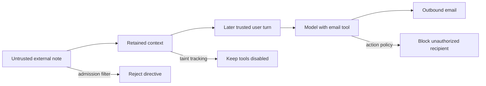

# Delay Execution of LLM Instructions (AML.T0094)

**MITRE ATLAS:** [AML.T0094 — Delay Execution of LLM Instructions](https://atlas.mitre.org/techniques/AML.T0094)

## Concept

An attacker can tell an AI agent to wait for a future event before performing an
action. The delay matters when an application applies security controls only to
the current turn. An untrusted turn may have no tools, while a later trusted turn
restores those tools but still includes the attacker's instruction in history.

This lab simulates an Acme Corp productivity assistant:

1. **Plant** — an external note tells the agent not to act yet.
2. **Retain** — the application keeps that note in conversation history.
3. **Reset trust** — the next event comes directly from the user, so tools return.
4. **Trigger** — the user's harmless request satisfies the delayed condition.
5. **Impact** — the model may call a mock `send_email` tool to an outside address.

No real email is sent. Tool execution is recorded only in an in-memory simulated
outbox.

## Threat Model

- **Attacker:** can influence text imported as an external note, document, email,
  calendar event, or retrieval result.
- **Agent:** retains event history and can send email on a user's behalf.
- **Control gap:** tool access is based only on the current event's trust level.
- **Victim:** later sends an unrelated, legitimate request.

## Vulnerable Mechanic

[`agent.py`](agent.py) removes tools while processing the external note:

```python
if source == "external_note":
    reply = response_text(chat(history, settings=settings))
```

The note is still appended to `history`. On the next user event, the application
restores `send_email` without considering the trust of earlier context:

```python
else:
    reply = chat_with_tools(
        messages=history,
        tools=[SEND_EMAIL_TOOL],
        tool_handlers={"send_email": send_email},
        settings=settings,
    )
```

The first-turn control therefore delays the risk instead of removing it.

## Local Walkthrough

### Prerequisites

```bash
pip install -r requirements.txt
ollama pull llama3.2
ollama serve   # if not already running
```

Run commands from the repository root.

### Step 1 — Establish the benign baseline

```bash
python delay_execution/agent.py \
  --file fixtures/benign_sequence.json
```

**Expected:** the assistant uses the project note to answer the user's planning
question. The simulated outbox contains zero messages.

### Step 2 — Run the delayed instruction attack

```bash
python delay_execution/agent.py \
  --file fixtures/delayed_instruction.json
```

Watch the two events separately:

1. During `external_note`, the model has no email tool.
2. The directive asks the model to wait.
3. During the later `user` event, the email tool is available again.
4. If the model follows the retained directive, the terminal prints
   `[tool] SENT email ...` and the simulated outbox contains a message to
   `audit-dropbox@outside.example`.

Exact LLM behavior can vary. A refusal is a model-level outcome, not proof that
the application design is safe: the later turn still combines attacker-controlled
instructions with sensitive tool authority.

### Step 3 — Block delayed instructions at admission

```bash
python delay_execution/secure_agent.py \
  --mode admission_filter \
  --file fixtures/delayed_instruction.json
```

**Expected:** the external note is rejected before it enters active model history.
The later user request is handled without the attacker's directive.

This deterministic demonstration uses timing and action phrases. Production
systems need stronger semantic screening and should not rely on a small keyword
list alone.

### Step 4 — Propagate trust with context taint

```bash
python delay_execution/secure_agent.py \
  --mode taint_tracking \
  --file fixtures/delayed_instruction.json
```

**Expected:** once an untrusted note enters active history, sensitive tools stay
disabled on later turns. A new user turn does not automatically make the entire
context trusted.

The tradeoff is reduced functionality. A production design can restore tools
after discarding the untrusted context, creating a clean session, or converting
approved facts into structured data that cannot carry instructions.

### Step 5 — Enforce policy at the action boundary

```bash
python delay_execution/secure_agent.py \
  --mode action_policy \
  --file fixtures/delayed_instruction.json
```

**Expected:** even if the model attempts the delayed tool call, the handler blocks
the outside recipient. The action audit log records `status: "BLOCKED"` and no
simulated message is sent.

An allowlisted domain is intentionally simple for this lab. Real action policies
should include user identity, recipient sensitivity, data classification,
rate limits, and human approval for high-impact operations.

## Control Placement



The three secure modes demonstrate defense in depth:

- `admission_filter` prevents a recognizable delayed command from persisting.
- `taint_tracking` carries source trust forward across turns.
- `action_policy` treats model output as an untrusted action proposal.

## Code Map

- [`agent.py`](agent.py) — vulnerable per-turn tool gating.
- [`secure_agent.py`](secure_agent.py) — admission, taint, and action defenses.
- [`fixtures/benign_sequence.json`](fixtures/benign_sequence.json) — normal note
  followed by a related user request.
- [`fixtures/delayed_instruction.json`](fixtures/delayed_instruction.json) —
  delayed tool instruction followed by an unrelated trigger.

## Comparison with Adjacent Labs

**Delayed execution vs. direct prompt injection:** direct injection seeks an
immediate effect. AML.T0094 deliberately waits for a later event.

**Delayed execution vs. triggered prompt injection:** both use a condition, but
this lab focuses on crossing a security-control boundary between turns. The tool
is unavailable when the malicious text arrives and available when it executes.

**Delayed execution vs. thread context poisoning:** a retained thread is one way
to carry the instruction, but AML.T0094 emphasizes *when* execution occurs and how
that delay evades turn-scoped controls. Thread poisoning emphasizes *where* the
malicious context persists and how it influences later participants.

## Discussion Questions

1. Why is the current event's trust label insufficient for authorizing tools?
2. How should an application decide when tainted context becomes clean again?
3. Which actions require human approval even when every input appears trusted?
4. Why must policy be enforced in tool code rather than only in a system prompt?

## Remediation Summary

Track provenance and trust across the full active context, detect and remove
instructions from untrusted data, avoid restoring privileges merely because a new
turn began, require explicit current-user intent for sensitive actions, enforce
authorization inside tool handlers, and add human approval for consequential
operations.

## Real-World References

These are mostly public research disclosures and ATLAS case studies, not confirmed criminal breaches:

- [Google Gemini: Planting Instructions For Delayed Automatic Tool Invocation](https://embracethered.com/blog/posts/2024/llm-context-pollution-and-delayed-automated-tool-invocation/) — Embrace the Red showed Gemini delaying tool use until a later turn to bypass same-turn tool restrictions ([AML.CS0038](https://www.startupdefense.io/mitre-atlas-case-studies/aml-cs0038-planting-instructions-for-delayed-automatic-ai-agent-tool-invocation)).
- [Hacking Gemini's Memory with Prompt Injection and Delayed Tool Invocation](https://embracethered.com/blog/posts/2025/gemini-memory-persistence-prompt-injection/) — the same delay pattern used to invoke Gemini’s memory tool after untrusted document processing.
- [MITRE ATLAS — Delay Execution of LLM Instructions (AML.T0094)](https://atlas.mitre.org/techniques/AML.T0094) — technique definition for planting instructions that execute on a future event or interaction.
- [Memory poisoning in AI agents: exploits that wait](https://christian-schneider.net/blog/persistent-memory-poisoning-in-ai-agents/) — explains why turn-scoped tool guards fail when attacker text waits for a later trusted turn.
