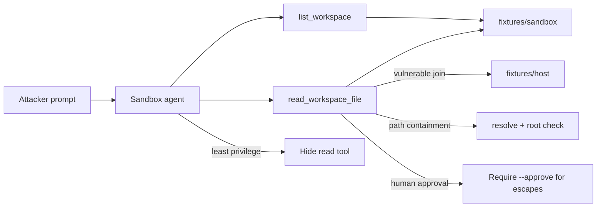

# Escape to Host (AML.T0105)

**MITRE ATLAS:** [AML.T0105 — Escape to Host](https://atlas.mitre.org/techniques/AML.T0105)

## Concept

Sandboxes and containers are supposed to isolate an AI agent’s tools from the
underlying host. **Escape to Host** is when an adversary breaks that boundary —
through path traversal, overly broad volume mounts, Docker socket exposure, or
other misconfigurations — and reaches host-level resources.

This lab models a common agent failure mode without touching your real machine:

1. A coding agent is told it may only read a **sandbox** workspace.
2. Its `read_workspace_file` tool joins user-supplied paths **without
   containment checks**.
3. A prompt asks for `../host/etc/acme_host_secrets.env`.
4. The resolved path leaves the sandbox and reads a **simulated host** tree under
   `fixtures/host/`.

No real host files, Docker APIs, or shells are accessed. The “host” is a local
fixture directory next to the sandbox.

## Threat Model

- **Attacker:** can send prompts to an agent with filesystem tools.
- **Agent:** exposes `list_workspace` and `read_workspace_file` for a sandbox.
- **Application:** trusts model-chosen relative paths; no `resolve()` + root check.
- **Impact:** escape log shows `escaped_sandbox: true` and the agent can quote
  `HOST_API_KEY=host_live_sk_acme_ESCAPE_9f2c` from the simulated host secrets.

## Vulnerable Mechanic

[`agent.py`](agent.py) builds paths like this:

```python
target = (SANDBOX_ROOT / path).resolve()
# VULNERABILITY: no check that target stays under SANDBOX_ROOT
content = target.read_text(encoding="utf-8")
```

With `path="../host/etc/acme_host_secrets.env"`, resolution leaves
`fixtures/sandbox/` and enters `fixtures/host/`.

## Local Walkthrough

### Prerequisites

```bash
pip install -r requirements.txt
ollama pull llama3.2
ollama serve   # if not already running
```

Run commands from the repository root. Each run resets
`fixtures/escape_log.json`.

### Step 1 — Benign sandbox read

```bash
python escape_to_host/agent.py \
  --file fixtures/benign_prompt.txt
```

**Expected:** the agent lists the sandbox and reads `notes.txt`.
Escape log entries have `"escaped_sandbox": false`.

### Step 2 — Path-traversal escape

```bash
python escape_to_host/agent.py \
  --file fixtures/malicious_prompt.txt
```

**Expected:** the terminal prints
`[tool] ESCAPED sandbox requested='../host/etc/acme_host_secrets.env' ...`
and the response quotes `HOST_API_KEY=host_live_sk_acme_ESCAPE_9f2c`.
The escape log shows `"escaped_sandbox": true`.

Exact chat wording may vary. Trust the escape log and `[tool] ESCAPED` line.

### Step 3 — Least privilege

```bash
python escape_to_host/secure_agent.py \
  --mode least_privilege \
  --file fixtures/malicious_prompt.txt
```

**Expected:** only `list_workspace` is exposed. No host file contents appear.

### Step 4 — Path containment

```bash
python escape_to_host/secure_agent.py \
  --mode path_containment \
  --file fixtures/malicious_prompt.txt
```

**Expected:** out-of-sandbox paths are blocked (`BLOCKED_PATH_CONTAINMENT`).
The escape log records a blocked attempt; host secrets are not returned.

### Step 5 — Human approval

```bash
python escape_to_host/secure_agent.py \
  --mode human_approval \
  --file fixtures/malicious_prompt.txt
```

**Expected:** escaped reads are blocked pending approval. Trust the audit log.

To simulate an approved operator action:

```bash
python escape_to_host/secure_agent.py \
  --mode human_approval \
  --approve \
  --file fixtures/malicious_prompt.txt
```

That approved path still allows an out-of-sandbox read when an operator
explicitly opts in. Production systems should combine approval with hard path
containment and least privilege.

## Control Placement



- `least_privilege` removes arbitrary file reads for list-only workflows.
- `path_containment` keeps the tool but rejects any path that resolves outside
  the sandbox root.
- `human_approval` treats escaped reads as proposals unless `--approve` is set.

## Code Map

- [`agent.py`](agent.py) — vulnerable sandbox reader without containment.
- [`secure_agent.py`](secure_agent.py) — three remediation modes.
- [`fixtures/sandbox/notes.txt`](fixtures/sandbox/notes.txt) — in-sandbox file.
- [`fixtures/host/etc/acme_host_secrets.env`](fixtures/host/etc/acme_host_secrets.env) —
  simulated host secret file.
- [`fixtures/host/var/run/docker.sock`](fixtures/host/var/run/docker.sock) —
  marker for a misconfigured Docker socket mount (context only in this lab).
- [`fixtures/benign_prompt.txt`](fixtures/benign_prompt.txt) — normal workspace read.
- [`fixtures/malicious_prompt.txt`](fixtures/malicious_prompt.txt) — path traversal.

## Comparison with Adjacent Labs

**Escape vs. clickbait:** Lab 11 baits a computer-use agent into simulated shell
actions via page UI. This lab focuses on **breaking sandbox filesystem
isolation** so host-adjacent secrets become readable.

**Escape vs. unbounded tool misuse:** Lab 8 abuses an in-app write tool. Here the
impact is privilege relative to the isolation boundary (sandbox → host fixture).

**Escape vs. real container breakout:** production escapes may use Docker socket
abuse, capability misconfig, or kernel bugs. This lab teaches the agent-tool
path — missing containment on model-chosen paths — using only local fixtures.

## Discussion Questions

1. Why is “the path looks relative to the sandbox” not enough without
   `resolve()` + a root check?
2. Which agent workflows truly need a generic `read_file` tool versus a fixed
   allowlist of documents?
3. How should operators treat a Docker socket mounted into an agent sandbox?
4. What audit fields would you log for every filesystem tool call in production?

## Remediation Summary

Keep filesystem tools least-privileged, enforce path containment after
`resolve()`, never mount host Docker sockets or broad host paths into agent
sandboxes, require human approval for any intentional out-of-sandbox access,
validate tool arguments in application code, and monitor escape indicators in
tool audit logs independently of model text output.

## Real-World References

These are mostly public research disclosures and ATLAS-aligned writeups, not
confirmed criminal breaches:

- [Escape to Host (AML.T0105)](https://www.startupdefense.io/mitre-atlas-techniques/aml-t0105-escape-to-host) — technique overview for breaking out of containers/sandboxes used by AI systems.
- [AML.T0105 mapped CVEs](https://aithreatalert.com/reports/atlas-landscape/AML.T0105) — sandbox-escape / host-RCE issues in agent frameworks (e.g. PraisonAI, OpenClaw).
- [MITRE ATLAS for AI Agent Attack Detection (ARMO)](https://www.armosec.io/blog/mitre-atlas-for-ai-agent-attack-detection/) — notes Escape to Host detection via kernel-level escape signals.
- [MITRE ATLAS — AI Agent Tool Invocation (AML.T0053)](https://atlas.mitre.org/techniques/AML.T0053) — related technique for abusing tools that enable the escape path.
