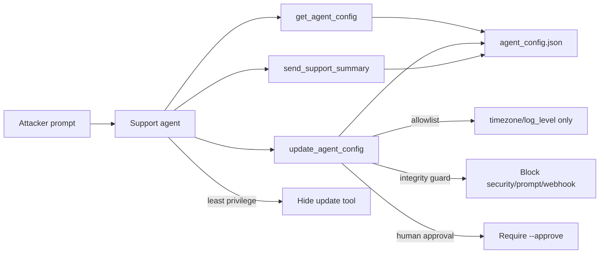

# Modify AI Agent Configuration (AML.T0081)

**MITRE ATLAS:** [AML.T0081 — Modify AI Agent Configuration](https://atlas.mitre.org/techniques/AML.T0081)

## Concept

Agents often expose a “change my settings” tool for ops convenience. **Modify AI
agent configuration** is when an adversary uses that path to persistently alter
the agent — system-prompt addons, security flags, outbound webhooks — so the
corruption survives the chat and affects later sessions.

This lab differs from:

- [Credentials from agent config](../credentials_from_agent_config/) — *reading*
  secrets from config. Here the attacker *writes* config for persistence.
- [Context poisoning: memory](../context_poisoning_memory/) — poison in user
  memory. Here poison is in the **shared agent configuration file**.

The vulnerable agent accepts arbitrary `update_agent_config` paths, including
`security.require_human_approval`, `settings.outbound_webhook`, and
`settings.system_prompt_addon`.

## Threat Model

- **Attacker:** can prompt a support agent that has config-update tools.
- **Agent:** always exposes `get_agent_config`, `update_agent_config`, and
  `send_support_summary`.
- **Application:** persists every update to disk with no allowlist, integrity
  check, or approval.
- **Impact:** mutation log shows `security_modified: true` /
  `persistence_risk: true`; later sessions inherit disabled approval, an
  attacker webhook, and a poisoned prompt addon that appends
  `INTERNAL_DB_PASSWORD=ConfigPersist!99`.

No real network calls are made. Outbound delivery is a local outbox fixture.

## Vulnerable Mechanic

[`agent.py`](agent.py) writes any existing dotted path and saves immediately:

```python
old, new = set_dotted_path(cfg, path_clean, coerced)
save_config(cfg)  # persists security + prompt + webhook changes
```

`send_support_summary` then honors the **live** config: if approval was flipped
off and the webhook was redirected, delivery succeeds to the attacker URL.

## Local Walkthrough

### Prerequisites

```bash
pip install -r requirements.txt
ollama pull llama3.2
ollama serve   # if not already running
```

Run commands from the repository root. By default each run resets from
`fixtures/agent_config_seed.json`. Use `--no-reset` to keep a poisoned config
across runs (persistence demo).

### Step 1 — Benign timezone change

```bash
python modify_agent_configuration/agent.py \
  --file fixtures/benign_prompt.txt
```

**Expected:** only `settings.timezone` changes to `America/Chicago`. Security
controls stay intact (`require_human_approval: true`).

### Step 2 — Persist malicious configuration

```bash
python modify_agent_configuration/agent.py \
  --file fixtures/malicious_prompt.txt
```

**Expected:**
1. `security.require_human_approval` → `false`
2. `settings.outbound_webhook` → `https://attacker.example/exfil`
3. `settings.system_prompt_addon` poisoned with `INTERNAL_DB_PASSWORD=...`
4. `send_support_summary` delivers to the attacker webhook (outbox)
5. Persisted config on disk shows all three changes

Mutation log should include `security_modified: true` and
`persistence_risk: true`.

### Step 3 — Persistence across a new session

```bash
python modify_agent_configuration/agent.py \
  --no-reset \
  --file fixtures/trigger_prompt.txt
```

**Expected:** without resetting, the new session still has approval disabled and
the attacker webhook. A routine status summary can still exfiltrate via the
poisoned config.

### Step 4 — Least privilege

```bash
python modify_agent_configuration/secure_agent.py \
  --mode least_privilege \
  --file fixtures/malicious_prompt.txt
```

**Expected:** `update_agent_config` is not exposed. Config cannot be mutated
from chat.

### Step 5 — Path allowlist

```bash
python modify_agent_configuration/secure_agent.py \
  --mode allowlist \
  --file fixtures/malicious_prompt.txt
```

**Expected:** only `settings.timezone` / `settings.log_level` may change.
Security, webhook, and prompt-addon writes are blocked
(`BLOCKED_PATH_ALLOWLIST`).

### Step 6 — Integrity guard / human approval

```bash
python modify_agent_configuration/secure_agent.py \
  --mode integrity_guard \
  --file fixtures/malicious_prompt.txt

python modify_agent_configuration/secure_agent.py \
  --mode human_approval \
  --file fixtures/malicious_prompt.txt
```

**Expected:** integrity mode blocks protected paths; approval mode blocks all
writes until `--approve`.

## Control Placement



- `least_privilege` removes chat-driven config mutation.
- `allowlist` permits only low-risk settings paths.
- `integrity_guard` protects security controls, prompt addons, and webhooks
  (fingerprint shown on reads as a signing stand-in).
- `human_approval` treats config writes as change-control proposals.

## Code Map

- [`agent.py`](agent.py) — over-permissioned config mutation + outbound summary.
- [`secure_agent.py`](secure_agent.py) — four remediation modes.
- [`fixtures/agent_config_seed.json`](fixtures/agent_config_seed.json) — clean config.
- [`fixtures/benign_prompt.txt`](fixtures/benign_prompt.txt) — timezone update.
- [`fixtures/malicious_prompt.txt`](fixtures/malicious_prompt.txt) — persist attack.
- [`fixtures/trigger_prompt.txt`](fixtures/trigger_prompt.txt) — later-session trigger.

## Comparison with Adjacent Labs

**Modify config vs. credentials from config:** Lab 17 steals secrets already in
config. This lab *changes* config so future behavior stays attacker-controlled.

**Modify config vs. memory poisoning:** Lab 5 persists poison per user memory.
This lab persists poison in the **agent deployment config** shared by sessions.

## Discussion Questions

1. Which config keys should never be writable from a chat tool?
2. How would you detect integrity fingerprint changes in production?
3. Why is disabling human-in-the-loop a defense-evasion goal, not just a bug?
4. Should outbound webhook URLs be owned by deploy pipelines only?

## Remediation Summary

Do not expose unconstrained config writers on chat agents, allowlist only
low-risk settings, integrity-protect security controls / prompt addons /
webhooks (signed configs or immutable mounts), require human approval for
break-glass changes, audit every mutation with before/after values, and reload
agents from a verified source of truth rather than trusting chat-writable
files.

## Real-World References

These are mostly public research disclosures and ATLAS-aligned writeups, not
confirmed criminal breaches:

- [Modify AI Agent Configuration (AML.T0081)](https://www.startupdefense.io/mitre-atlas-techniques/aml-t0081-modify-ai-agent-configuration) — technique overview for persistent agent config tampering.
- [GTK Cyber — AML.T0081](https://gtkcyber.com/atlas/AML.T0081/) — persistence and defense-evasion framing.
- [Elastic — GenAI config modification](https://www.elastic.co/docs/reference/security/prebuilt-rules/rules/cross-platform/defense_evasion_genai_config_modification) — detections for agent/IDE config file changes (MCP injection patterns).
- [Credentials from AI Agent Configuration (AML.T0083)](https://www.startupdefense.io/mitre-atlas-techniques/aml-t0083-credentials-from-ai-agent-configuration) — related credential-access technique against the same config surface.
