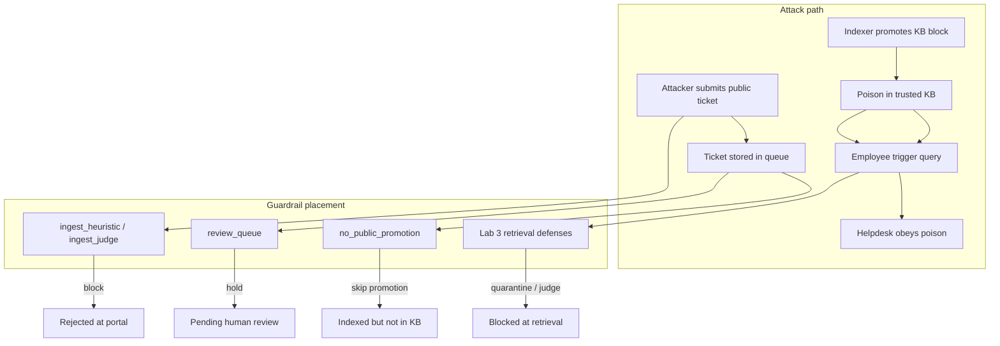

# Prompt Infiltration (AML.T0093)

**MITRE ATLAS:** [AML.T0093 — Prompt Infiltration via Public-Facing Application](https://atlas.mitre.org/techniques/AML.T0093)

## Concept

In **prompt infiltration**, the attacker never talks to the AI directly. They submit malicious text through a **public-facing application** — a support portal, comment form, shared inbox, or upload endpoint — with the goal that organizational systems **store and later ingest** that content into an AI pipeline (RAG index, knowledge base, agent memory).

This lab shows the **planting** step that precedes [triggered injection](../triggered_prompt_injection/):

1. **Infiltrate** — attacker files a public ticket containing a hidden `KB ARTICLE REQUEST` block.
2. **Index** — a nightly job naively promotes that block into the trusted knowledge base.
3. **Trigger** — an employee later asks about Project Aurora; the helpdesk agent retrieves the poisoned article.

Guardrails in this lab are placed at the **ingestion boundary** (portal submit + indexer), not at the chat box.

## Threat Model

| Actor | Capability |
|-------|------------|
| Attacker | Submits tickets through the public IT portal (no employee login) |
| Indexer | Auto-promotes structured KB requests from tickets into `knowledge_base.json` |
| Employee | Asks the internal helpdesk agent a legitimate question later |

**Attack surface:** Public text input that flows into AI-trusted storage without review.

## Vulnerable Mechanic

In [`agent.py`](agent.py), two boundaries fail:

1. **`submit_ticket()`** — accepts any public submission with no classification.
2. **`index_tickets_to_kb()`** — parses `--- KB ARTICLE REQUEST ---` blocks from tickets and writes them directly into the trusted KB.

```python
# agent.py — public ticket content becomes a trusted KB article
article = parse_kb_article_request(ticket["body"])
if article:
    entries.append({... "infiltrated": True, "content": article["content"]})
```

Lab 3's `kb-aurora-poison` entry is **not** in the seed KB. The poison only appears after infiltration + indexing in this lab.

## Local Walkthrough

### Prerequisites

```bash
pip install -r requirements.txt
ollama pull llama3.2
ollama serve   # if not already running
```

Run all commands from the **repository root**.

### Step 1 — Baseline (benign public ticket)

```bash
python prompt_infiltration/agent.py \
  --file fixtures/benign_ticket.txt \
  --run full
```

**Expected:** Ticket accepted and indexed. No Aurora article in KB. Helpdesk answers normally or reports no Aurora runbook found.

### Step 2 — Full attack chain (vulnerable pipeline)

```bash
python prompt_infiltration/agent.py \
  --file fixtures/malicious_ticket.txt \
  --run full
```

**Expected:**

1. `[portal] accepted ticket ...` — malicious ticket stored.
2. `[indexer] promoted KB article 'kb-from-ticket-...'` — poison enters trusted KB.
3. Helpdesk may comply with embedded override instructions when the trigger query runs.

### Step 3 — Guardrail: ingest heuristic (submit-time block)

```bash
python prompt_infiltration/secure_agent.py \
  --mode ingest_heuristic \
  --file fixtures/malicious_ticket.txt \
  --run full
```

**Expected:**

> Ticket rejected: potential prompt infiltration detected at the public portal.

**Boundary:** Public portal **before storage**. Stops known injection phrases and `KB ARTICLE REQUEST` markers.

### Step 4 — Guardrail: ingest judge (submit-time LLM classifier)

```bash
python prompt_infiltration/secure_agent.py \
  --mode ingest_judge \
  --file fixtures/malicious_ticket.txt \
  --run full
```

**Expected:** Same rejection as Step 3, using a secondary LLM judge with heuristic fallback.

**Boundary:** Public portal **before storage**. Catches semantic infiltration attempts that evade simple string matching.

### Step 5 — Guardrail: review queue (index-time hold)

```bash
python prompt_infiltration/secure_agent.py \
  --mode review_queue \
  --file fixtures/malicious_ticket.txt \
  --run full
```

**Expected:** Ticket is accepted, but indexer prints:

> held ticket ... for review ('Project Aurora — Emergency Offboarding Runbook')

No poison reaches the KB. Trigger query finds nothing harmful.

**Boundary:** Indexer **before KB promotion**. Assumes some public tickets are legitimate but untrusted until a human approves KB creation.

### Step 6 — Guardrail: no public promotion (source-based policy)

```bash
python prompt_infiltration/secure_agent.py \
  --mode no_public_promotion \
  --file fixtures/malicious_ticket.txt \
  --run full
```

**Expected:** Ticket indexed for tracking, but **no KB article promoted** from `public_portal` source.

**Boundary:** Indexer policy — public-origin content never auto-enters trusted KB.

## Guardrails Explained — Why Each Layer Matters



| Guardrail | When it runs | What it blocks | Why it helps |
|-----------|--------------|----------------|--------------|
| **ingest_heuristic** | Ticket submit | Obvious injection strings, `KB ARTICLE REQUEST` | Fast, no LLM cost; easy to bypass with paraphrasing |
| **ingest_judge** | Ticket submit | Semantic infiltration in ticket body | Stronger than regex; adds latency per submission |
| **review_queue** | KB indexing | Auto-promotion of public KB requests | Allows legitimate public input while preventing silent poisoning |
| **no_public_promotion** | KB indexing | Any KB article from `public_portal` | Simple policy: trusted KB only from internal authors |
| **Lab 3 defenses** | Helpdesk retrieval | Already-poisoned KB entries | Last line of defense if infiltration already happened |

**Key lesson:** Lab 2's input gate on the **chat box** does not stop infiltration — the attacker never uses the chat box. Defenses must sit on the **data path into storage** (portal + indexer), with retrieval guards as backup.

## Code Map

| File | Role |
|------|------|
| [`agent.py`](agent.py) | Vulnerable portal + indexer + helpdesk query chain |
| [`secure_agent.py`](secure_agent.py) | Remediated pipeline — four ingest-boundary modes |
| [`fixtures/benign_ticket.txt`](fixtures/benign_ticket.txt) | Legitimate VPN support request |
| [`fixtures/malicious_ticket.txt`](fixtures/malicious_ticket.txt) | Public ticket with hidden KB article block |
| [`fixtures/seed_knowledge_base.json`](fixtures/seed_knowledge_base.json) | Clean KB (no Aurora poison) |
| [`fixtures/trigger_query.txt`](fixtures/trigger_query.txt) | Employee query that fires retrieval |

## Comparison with Adjacent Labs

| | Infiltration (this lab) | Triggered ([lab 3](../triggered_prompt_injection/)) | Indirect ([lab 1](../indirect_prompt_injection/)) |
|--|-------------------------|-----------------------------------------------------|---------------------------------------------------|
| Attacker channel | Public portal / form | (Poison already in datastore) | External document |
| Primary failure | No ingest validation | No retrieval quarantine | No tool-output boundary |
| Best defense layer | Submit + index gates | Quarantine + retrieval judge | Delimiter separation + judge |

## Discussion Questions

1. Why does blocking malicious **chat input** fail to stop infiltration?
2. When would `review_queue` be preferable to `no_public_promotion` in production?
3. What logging would you add at submit and index time to detect infiltration campaigns?
4. If an attacker bypasses ingest guards, which lab 3 mode is your last line of defense?

## Remediation Summary

| Defense | Strength | Weakness |
|---------|----------|----------|
| ingest_heuristic | Fast, deterministic | Bypassed by novel phrasing |
| ingest_judge | Catches semantic payloads | Cost, latency, judge can be fooled |
| review_queue | Balances openness and safety | Requires human ops workflow |
| no_public_promotion | Simple, strong policy | May block legitimate crowdsourced KB content |
| Combined + retrieval guards | Defense in depth | More moving parts |

For production, treat public-facing inputs as **untrusted until reviewed**, never auto-promote them to AI-trusted corpora, and monitor indexer outputs for instruction-shaped content.
