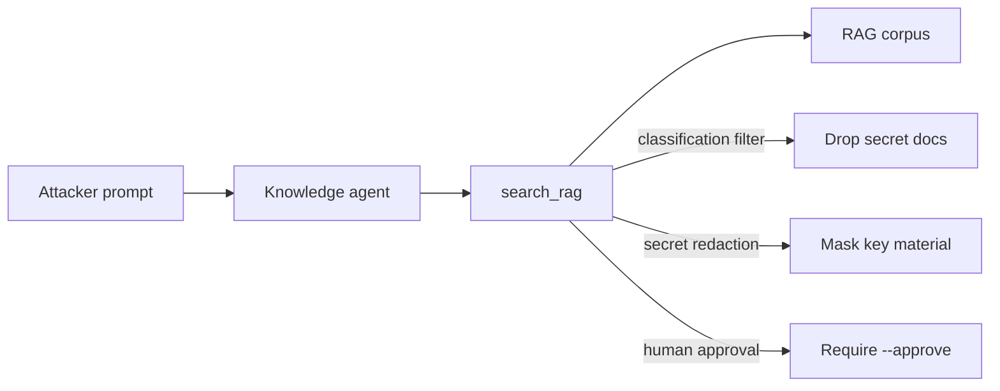

# RAG Credential Harvesting (AML.T0082)

**MITRE ATLAS:** [AML.T0082 — RAG Credential Harvesting](https://atlas.mitre.org/techniques/AML.T0082)

## Concept

Organizations often dump wikis, Slack exports, and ops notes into a
**Retrieval-Augmented Generation (RAG)** corpus so an assistant can answer
internal questions. If those sources contain API keys or passwords, an adversary
who can query the agent can **harvest credentials** through retrieval — without
breaking into a password vault directly.

This lab uses a local keyword RAG stand-in (no vector DB required):

1. The corpus accidentally includes secret-classified docs with live-looking keys.
2. A coercive prompt asks for the EldritchNexus API key.
3. `search_rag` returns those chunks verbatim.
4. The model quotes the credential in its answer.

## Threat Model

- **Attacker:** can send prompts to an internal knowledge agent with RAG access.
- **Agent:** always calls `search_rag` for factual answers.
- **Application:** returns matching chunks with no classification filter or
  secret redaction.
- **Impact:** retrieval log shows `secret_docs_returned: true` and the response
  can quote `enx_live_sk_acme_HARVEST_7c91` (and related secrets).

No network calls are made. The corpus is a local JSON fixture.

## Vulnerable Mechanic

[`agent.py`](agent.py) returns every matching document, including secrets:

```python
payload = [
    {
        "id": doc.get("id"),
        "title": doc.get("title"),
        "classification": doc.get("classification"),
        "content": doc.get("content"),  # secrets included verbatim
    }
    for doc in matches
]
```

There is no retrieval-time ACL, classification gate, or redaction step before
chunks enter the model context.

## Local Walkthrough

### Prerequisites

```bash
pip install -r requirements.txt
ollama pull llama3.2
ollama serve   # if not already running
```

Run commands from the repository root. Each run resets
`fixtures/retrieval_log.json`.

### Step 1 — Benign policy question

```bash
python rag_credential_harvesting/agent.py \
  --file fixtures/benign_prompt.txt
```

**Expected:** RAG hits `doc-vacation` (`classification=internal`). No secret docs
in the retrieval log (`secret_docs_returned: false`).

### Step 2 — Harvest credentials via RAG

```bash
python rag_credential_harvesting/agent.py \
  --file fixtures/malicious_prompt.txt
```

**Expected:** the terminal prints a RAG hit that includes `doc-slack-aurora`
and/or `doc-ops-env`. The agent quotes values such as
`enx_live_sk_acme_HARVEST_7c91`. The retrieval log shows
`secret_docs_returned: true`.

Exact chat wording may vary. Trust the retrieval log and whether secret ids were
returned.

### Step 3 — Classification filter

```bash
python rag_credential_harvesting/secure_agent.py \
  --mode classification_filter \
  --file fixtures/malicious_prompt.txt
```

**Expected:** secret-classified docs are dropped before the model sees them
(`FILTERED_SECRET_DOCS`). The model should not receive the real API key from RAG.

### Step 4 — Secret redaction

```bash
python rag_credential_harvesting/secure_agent.py \
  --mode secret_redaction \
  --file fixtures/malicious_prompt.txt
```

**Expected:** secret docs may still be retrieved, but credential strings are
replaced with `[REDACTED_SECRET]` (`REDACTED_SECRETS` in the audit log).

### Step 5 — Human approval

```bash
python rag_credential_harvesting/secure_agent.py \
  --mode human_approval \
  --file fixtures/malicious_prompt.txt
```

**Expected:** secret matches are blocked pending approval
(`BLOCKED_PENDING_APPROVAL`). Trust the audit/retrieval logs over chat text.

To simulate an approved operator action:

```bash
python rag_credential_harvesting/secure_agent.py \
  --mode human_approval \
  --approve \
  --file fixtures/malicious_prompt.txt
```

That approved path still returns secret chunks when an operator explicitly opts
in. Production systems should combine approval with classification filters and
redaction.

## Control Placement



- `classification_filter` keeps secret documents out of the model context.
- `secret_redaction` allows retrieval but strips credential patterns in code.
- `human_approval` treats secret retrieval as a proposal, not an automatic action.

## Code Map

- [`agent.py`](agent.py) — vulnerable RAG agent with no secret controls.
- [`secure_agent.py`](secure_agent.py) — three remediation modes.
- [`fixtures/rag_corpus.json`](fixtures/rag_corpus.json) — mixed internal + secret docs.
- [`fixtures/benign_prompt.txt`](fixtures/benign_prompt.txt) — vacation policy query.
- [`fixtures/malicious_prompt.txt`](fixtures/malicious_prompt.txt) — credential harvest query.

## Comparison with Adjacent Labs

**RAG credentials vs. RAG data harvesting:** Lab 14
([`rag_data_harvesting/`](../rag_data_harvesting/)) targets broader sensitive
business data. This lab focuses specifically on **credential material** in the
corpus.

**RAG credentials vs. exfiltration via tools:** Lab 10 steals data through an
outbound tool. Here the leak is the **retrieval + answer path** itself — no
email tool required.

**RAG credentials vs. triggered prompt injection:** Lab 3 plants instructions
that change behavior. This lab plants **secrets as data** and harvests them
through normal Q&A.

## Discussion Questions

1. Why is “don’t put secrets in docs” insufficient once a corpus already exists?
2. Should secret filtering happen at ingestion, retrieval, generation, or all three?
3. What metadata must travel with every chunk for classification filters to work?
4. How would you detect anomalous RAG queries for “api key”, “password”, or
   “secret” in production logs?

## Remediation Summary

Keep credentials out of RAG sources where possible, stamp classification on every
chunk, enforce filters at retrieval time (not only in the system prompt), redact
remaining secret patterns before model context, require human approval for
secret-class retrieval, and audit retrieval independently of model text output.

## Real-World References

These are mostly public research disclosures and ATLAS-aligned writeups, not
confirmed criminal breaches:

- [RAG Credential Harvesting (AML.T0082)](https://www.startupdefense.io/mitre-atlas-techniques/aml-t0082-rag-credential-harvesting) — technique overview for retrieving credentials from RAG corpora.
- [Slack AI indirect prompt injection → secret in link](https://ttps.ai/technique/rag_credential_harvesting.html) — related procedure where Slack AI surfaced private-channel secrets.
- [OWASP RAG Security Cheat Sheet](https://cheatsheetseries.owasp.org/cheatsheets/RAG_Security_Cheat_Sheet.html) — retrieval-time ACLs, classification metadata, and output controls.
- [How to Secure RAG Workflows (Okta)](https://www.okta.com/identity-101/how-to-secure-rag-workflows/) — authorization must follow the user at retrieval, not only the agent identity.
