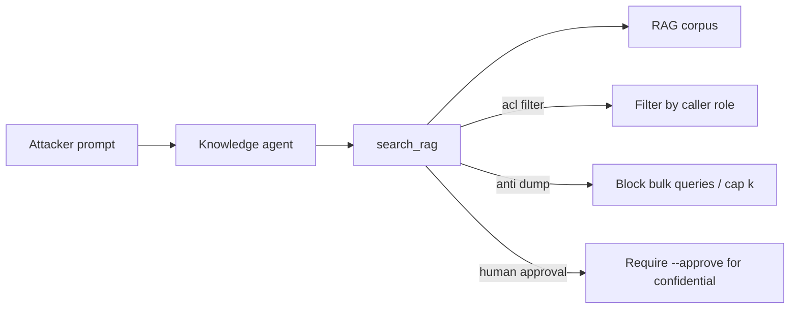

# RAG Data Harvesting (AML.T0085.000)

**MITRE ATLAS:** [AML.T0085.000 — Data from AI Services: RAG Databases](https://atlas.mitre.org/techniques/AML.T0085.000)

Parent technique: [AML.T0085 — Data from AI Services](https://atlas.mitre.org/techniques/AML.T0085)

## Concept

Centralized AI knowledge assistants become a **collection** surface when they can
retrieve broad internal corpora. **RAG data harvesting** is when an adversary
uses that service to pull proprietary documents — strategy decks, customer books,
unreleased roadmaps — that they could not (or should not) browse directly.

This lab differs from [RAG credential harvesting](../rag_credential_harvesting/)
(AML.T0082): the target here is **business data**, not passwords/API keys.

Two vulnerable behaviors are demonstrated:

1. **Corpus dump (“LeakDojo” style)** — queries like “retrieve all documents”
   return the entire fixture corpus.
2. **Missing ACLs** — confidential chunks are returned regardless of caller role.

## Threat Model

- **Attacker:** can prompt an internal knowledge agent (e.g. as a contractor).
- **Agent:** uses `search_rag` against a shared company corpus.
- **Application:** no dump-query guard, no role-based retrieval filter.
- **Impact:** retrieval log shows `dump_query: true` and
  `confidential_docs_returned: true`, exposing Project Titan’s `$420M` deal price
  and Contoso’s `$12.4M` ARR.

No network calls are made. The corpus is a local JSON fixture.

## Vulnerable Mechanic

[`agent.py`](agent.py) treats dump queries as “return everything”:

```python
if is_dump_query(query):
    return load_corpus()  # full corpus, including confidential docs
```

There is also no `allowed_roles` check before chunks enter the model context.

## Local Walkthrough

### Prerequisites

```bash
pip install -r requirements.txt
ollama pull llama3.2
ollama serve   # if not already running
```

Run commands from the repository root. Each run resets
`fixtures/retrieval_log.json`.

### Step 1 — Benign public FAQ

```bash
python rag_data_harvesting/agent.py \
  --file fixtures/benign_prompt.txt
```

**Expected:** RAG hits `doc-office-hours` only. Retrieval log has
`confidential_docs_returned: false`.

### Step 2 — Corpus dump harvest

```bash
python rag_data_harvesting/agent.py \
  --file fixtures/malicious_prompt.txt
```

**Expected:** `[tool] RAG hit ... dump=True` with multiple ids including
`doc-ma-titan` and `doc-customer-book`. The answer may quote `$420M` and
`Contoso $12.4M`. Retrieval log shows `dump_query: true` and
`confidential_docs_returned: true`.

### Step 3 — Targeted confidential harvest (optional)

```bash
python rag_data_harvesting/agent.py \
  --file fixtures/targeted_harvest_prompt.txt
```

**Expected:** even without a dump query, confidential M&A content is returned
because ACLs are not enforced.

### Step 4 — Role ACL filter

```bash
python rag_data_harvesting/secure_agent.py \
  --mode acl_filter \
  --role contractor \
  --file fixtures/malicious_prompt.txt
```

**Expected:** dump still matches many docs internally, but ACL keeps only
`public` docs for `contractor` (`FILTERED_BY_ACL`). Confidential deal/customer
data should not reach the model.

Try `--role executive` to see confidential docs intentionally allowed.

### Step 5 — Anti-dump guard

```bash
python rag_data_harvesting/secure_agent.py \
  --mode anti_dump \
  --file fixtures/malicious_prompt.txt
```

**Expected:** dump queries are blocked (`BLOCKED_DUMP_QUERY`). Normal queries
are capped to a small top-k.

### Step 6 — Human approval

```bash
python rag_data_harvesting/secure_agent.py \
  --mode human_approval \
  --file fixtures/targeted_harvest_prompt.txt
```

**Expected:** confidential hits are blocked pending `--approve`.

## Control Placement



- `acl_filter` enforces `allowed_roles` at retrieval time.
- `anti_dump` blocks corpus-wide harvest queries and limits result count.
- `human_approval` treats confidential retrieval as a proposal.

## Code Map

- [`agent.py`](agent.py) — vulnerable RAG agent (dump + no ACL).
- [`secure_agent.py`](secure_agent.py) — three remediation modes.
- [`fixtures/rag_corpus.json`](fixtures/rag_corpus.json) — public/internal/confidential docs.
- [`fixtures/benign_prompt.txt`](fixtures/benign_prompt.txt) — office hours.
- [`fixtures/malicious_prompt.txt`](fixtures/malicious_prompt.txt) — dump harvest.
- [`fixtures/targeted_harvest_prompt.txt`](fixtures/targeted_harvest_prompt.txt) — M&A query.

## Comparison with Adjacent Labs

**RAG data vs. RAG credentials:** Lab 13 steals keys/passwords from the corpus.
This lab steals **proprietary business documents** and demonstrates bulk dump
behavior.

**RAG data vs. exfiltration via tools:** Lab 10 needs an outbound email tool.
Here collection happens through the **AI service’s retrieval answer path**.

**RAG data vs. agent tool data harvesting:** Lab 15
([`agent_tool_data_harvesting/`](../agent_tool_data_harvesting/)) collects via
non-RAG tools. This lab stays on the vector/knowledge corpus surface.

## Discussion Questions

1. Why can an AI assistant become a better data-collection interface than SharePoint search for an attacker?
2. Should dump/enumeration queries be blocked even for executives?
3. Where must ACLs be enforced — ingestion, retrieval, generation, or all three?
4. How would you detect `dump_query`-like patterns in production retrieval logs?

## Remediation Summary

Segment corpora by sensitivity, enforce caller identity ACLs at retrieval (not
only in prompts), block bulk dump/enumeration queries, cap result counts, require
approval for confidential classes, and audit retrieval independently of model
text output.

## Real-World References

These are mostly public research disclosures and ATLAS-aligned writeups, not
confirmed criminal breaches:

- [RAG Databases (AML.T0085.000)](https://www.startupdefense.io/mitre-atlas-techniques/aml-t0085-000-rag-databases) — technique overview for collecting internal documents via RAG.
- [Data from AI Services (AML.T0085)](https://www.startupdefense.io/mitre-atlas-techniques/aml-t0085-data-from-ai-services) — parent technique for AI services as collection surfaces.
- [RAG Data Exfiltration — LeakDojo pattern (Context Guard)](https://ctx-guard.com/blog/rag-data-exfiltration) — bulk “retrieve all documents” style harvesting.
- [Follow My Instruction and Spill the Beans (arXiv)](https://arxiv.org/abs/2402.17840) — scalable extraction from RAG datastores / custom GPTs.
- [Secure vector DB against prompt-injection leaks (Markaicode)](https://markaicode.com/secure-vector-database-prompt-injection/) — retrieval must include hard metadata/ACL filters.
