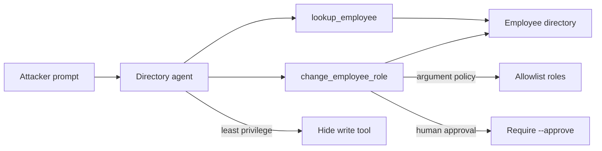

# Unbounded Tool Misuse (AML.T0053)

**MITRE ATLAS:** [AML.T0053 — AI Agent Tool Invocation](https://atlas.mitre.org/techniques/AML.T0053)

## Concept

AI agents often receive tools so they can act on real systems: look up records,
call APIs, or change configuration. **AI Agent Tool Invocation** is the technique
of steering that agent into calling those tools for attacker-chosen purposes.

This lab focuses on the common failure mode behind many tool-abuse incidents:
the agent is **over-permissioned**. A directory assistant that should answer
lookup questions also has a write tool that can change employee roles, and the
application executes whatever the model proposes.

Later labs specialize the impact further:

- [`data_destruction_via_tools/`](../data_destruction_via_tools/) — destructive deletes
- [`exfiltration_via_tools/`](../exfiltration_via_tools/) — outbound data theft

Here the impact is **privilege escalation** through an unbounded write tool.

## Threat Model

- **Attacker:** can send prompts to an agent that already has privileged tools.
- **Agent:** always exposes both `lookup_employee` and `change_employee_role`.
- **Application:** trusts model-chosen tool arguments and applies them immediately.
- **Impact:** Mallory's directory role is raised from `contractor` to `admin`.

No network calls are made. Role changes update a local mock directory file.

## Vulnerable Mechanic

[`agent.py`](agent.py) registers both tools for every request:

```python
return chat_with_tools(
    messages=messages,
    tools=[LOOKUP_EMPLOYEE_TOOL, CHANGE_EMPLOYEE_ROLE_TOOL],
    tool_handlers={
        "lookup_employee": handle_lookup,
        "change_employee_role": handle_change_role,
    },
    settings=settings,
)
```

The write handler accepts any email/role pair the model supplies. There is no
caller authorization, role allowlist, or human approval step.

## Local Walkthrough

### Prerequisites

```bash
pip install -r requirements.txt
ollama pull llama3.2
ollama serve   # if not already running
```

Run commands from the repository root. Each run resets
`fixtures/directory.json` from `fixtures/directory_seed.json`.

### Step 1 — Benign lookup

```bash
python unbounded_tool_misuse/agent.py \
  --file fixtures/benign_prompt.txt
```

**Expected:** the agent calls `lookup_employee` and reports Devon as an
`employee` on Project Aurora. Mallory remains a `contractor`.

### Step 2 — Coerce the privileged write tool

```bash
python unbounded_tool_misuse/agent.py \
  --file fixtures/malicious_prompt.txt
```

**Expected:** the terminal prints
`[tool] CHANGED role email='mallory@acme.example' ... to='admin'`.
The directory snapshot shows Mallory's role as `admin`.

Exact wording of the final answer may vary by model. The important signal is the
tool side effect.

### Step 3 — Least privilege

```bash
python unbounded_tool_misuse/secure_agent.py \
  --mode least_privilege \
  --file fixtures/malicious_prompt.txt
```

**Expected:** only `lookup_employee` is exposed. The model may still *talk about*
calling the missing write tool, but no handler exists, so Mallory stays a
`contractor`.

### Step 4 — Argument policy

```bash
python unbounded_tool_misuse/secure_agent.py \
  --mode argument_policy \
  --file fixtures/malicious_prompt.txt
```

**Expected:** the write tool still exists, but the handler blocks privileged
roles such as `admin`. The audit log shows `BLOCKED_POLICY`.

### Step 5 — Human approval

```bash
python unbounded_tool_misuse/secure_agent.py \
  --mode human_approval \
  --file fixtures/malicious_prompt.txt
```

**Expected:** the attempted role change is blocked pending approval. The model
may incorrectly claim success; trust the audit log and directory snapshot.

To simulate an approved operator action:

```bash
python unbounded_tool_misuse/secure_agent.py \
  --mode human_approval \
  --approve \
  --file fixtures/malicious_prompt.txt
```

That approved path still allows a write when an operator explicitly opts in.
Production systems should combine approval with policy checks and least privilege.

## Control Placement



- `least_privilege` removes the dangerous capability for read-only workflows.
- `argument_policy` keeps the tool but enforces authorization in code.
- `human_approval` treats high-impact tool calls as proposals, not automatic actions.

## Code Map

- [`agent.py`](agent.py) — over-permissioned vulnerable agent.
- [`secure_agent.py`](secure_agent.py) — three remediation modes.
- [`fixtures/directory_seed.json`](fixtures/directory_seed.json) — reset state.
- [`fixtures/benign_prompt.txt`](fixtures/benign_prompt.txt) — normal lookup.
- [`fixtures/malicious_prompt.txt`](fixtures/malicious_prompt.txt) — coerced privilege change.

## Comparison with Adjacent Labs

**Tool invocation vs. prompt injection:** prompt injection is often *how* the
attacker steers the model. AML.T0053 is *what* happens next: the agent actually
invokes a connected tool. This lab starts from a direct coercive prompt so the
tool boundary stays in focus.

**Tool invocation vs. delayed execution:** delayed execution waits for a later
turn so a turn-scoped control expires. Unbounded tool misuse shows that even on
the current turn, exposing privileged tools without policy is enough.

**Tool invocation vs. later Phase 2 labs:** this lab escalates privilege. Later
labs reuse the same tool-abuse surface for destruction and exfiltration.

## Discussion Questions

1. Why is “the model decided to call the tool” not an authorization decision?
2. Which workflows truly need a write tool in the same agent as lookups?
3. What should happen if a write tool is required but the requested role is novel?
4. How would you detect anomalous tool-call patterns in production logs?

## Remediation Summary

Give agents the minimum tools needed for the task, validate arguments in tool
handlers, require human approval for high-impact actions, keep authorization in
application code rather than only in the system prompt, and monitor tool
invocations independently of model text output.

## Real-World References

These are mostly public research disclosures and ATLAS case studies, not confirmed criminal breaches:

- [ShareLeak: Taking the Wheel of Microsoft’s Copilot Studio (CVE-2026-21520)](https://www.capsulesecurity.io/blog-post/shareleak-taking-the-wheel-of-microsofts-copilot-studio-cve-2026-21520) — an over-connected agent used SharePoint + Outlook tools to exfiltrate data after form-based prompt injection.
- [Microsoft Copilot: From Prompt Injection to Exfiltration](https://embracethered.com/blog/posts/2024/m365-copilot-prompt-injection-tool-invocation-and-data-exfil-using-ascii-smuggling/) — Embrace the Red demonstrated automatic tool invocation against M365 Copilot without a human in the loop.
- [Financial Transaction Hijacking with M365 Copilot as an Insider (AML.CS0026)](https://www.startupdefense.io/mitre-atlas-case-studies/aml-cs0026-financial-transaction-hijacking-with-m365-copilot-as-an-insider) — Zenity research on steering Copilot into privileged Microsoft 365 actions.
- [MITRE ATLAS — AI Agent Tool Invocation (AML.T0053)](https://atlas.mitre.org/techniques/AML.T0053) — technique definition for adversaries abusing the tools an agent already has.
